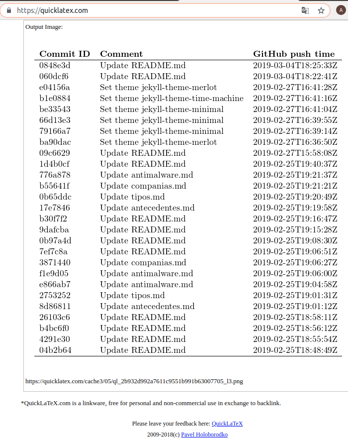

# github-event-times.py 

Este programa utiliza la API de "Eventos" de GitHub para imprimir todo el **push** tiempos para cada confirmación, con su salida en formato "tabular" de LaTeX. Esta podría ser útil si tienes un estudiante que sospechas que está falsificando comprometa los tiempos alrededor de una fecha límite y necesita documentar lo que sucedió.

## Instalación

1) Si aún no lo ha hecho, primero deberá agregar la libreria `pip install requests` para las considerar lo pertinente.

2) Obtenga un token de GitHub con todos los privilegios en  la opción de "Repo". Tú lo haces esto en el sitio web de GitHub [(siguientes instrucciones)](https://github.com/blog/1509-personal-api-tokens) para activarlo, el nombre ahí puede ser poer ejemplo CLASSROOM.

3) Opcionalmente, edite este archivo .py y modificar la variable `defautGithubProject` para reflejar su nombre del proyecto (por ejemplo, para `https://github.com/tectijuana`, el nombre de la ORGANIZACION es `tectijuana`) el cual se desprenden los URL de GitHub Classroom por ejemplo. También puedes instalar tu GitHub Token de API en la variable `defaultGithubToken`.
**IMPORTANTE MANTENER MUY PRIVADO EL TOKEN, SON DERECHOS IMPORTANTES DE LOS REPOSITORIO**

## Modo de uso

Ahora bien, digamos que desea obtener los tiempos de confirmación para una serie de repositorios
con:
_Estudiantes en GitHub Classroom Repos Formatos:_

assignment3-student1 and assignment3-student2, etc.

_Corrida:_

`python github-event-times.py assignment3-student1 assignment3-student2`

_Resultados:_

Esto imprimirá una tabla con los ID de confirmación (prefijo de 7 dígitos, mismo
como se informó en la lista de confirmaciones de GitHub), la cadena de confirmación y el
momento en que ese compromiso fue empujado a GitHub. 
**Puede ver el contenido compilado en http://quicklatex.com en linea por ejemplo.*


_NOTA: Tenga en cuenta que los tiempos son
informado en [RFC 3339] (https://www.ietf.org/rfc/rfc3339.txt) estilo,
que es UTC, por lo que es posible que desee ajustar esto a su hora local._

```
Example

ccitt@ccitt:~/github-event-times$ python github-event-times.py g410b1-markdown-mesa-3-pijamas-en-llamas
Events for g410b1-markdown-mesa-3-pijamas-en-llamas

\begin{tabular}{lll}
{\bf Commit ID} & {\bf Comment} & {\bf GitHub push time} \\
\hline
0848e3d & Update README.md & 2019-03-04T18:25:33Z \\
060dcf6 & Update README.md & 2019-03-04T18:22:41Z \\
e04156a & Set theme jekyll-theme-merlot & 2019-02-27T16:41:28Z \\
b1e0884 & Set theme jekyll-theme-time-machine & 2019-02-27T16:41:16Z \\
be33543 & Set theme jekyll-theme-minimal & 2019-02-27T16:41:04Z \\
66d13e3 & Set theme jekyll-theme-minimal & 2019-02-27T16:39:55Z \\
79166a7 & Set theme jekyll-theme-minimal & 2019-02-27T16:39:14Z \\
ba90dac & Set theme jekyll-theme-merlot & 2019-02-27T16:36:50Z \\
09c6629 & Update README.md & 2019-02-27T15:58:08Z \\
1d4b0cf & Update README.md & 2019-02-25T19:40:37Z \\
776a878 & Update antimalware.md & 2019-02-25T19:21:37Z \\
b55641f & Update companias.md & 2019-02-25T19:21:21Z \\
0b65ddc & Update tipos.md & 2019-02-25T19:20:49Z \\
17e7846 & Update antecedentes.md & 2019-02-25T19:19:58Z \\
b30f7f2 & Update README.md & 2019-02-25T19:16:47Z \\
9dafcba & Update README.md & 2019-02-25T19:15:28Z \\
0b97a4d & Update README.md & 2019-02-25T19:08:30Z \\
7ef7c8a & Update README.md & 2019-02-25T19:06:51Z \\
3871440 & Update companias.md & 2019-02-25T19:06:27Z \\
f1e9d05 & Update antimalware.md & 2019-02-25T19:06:00Z \\
e866ab7 & Update antimalware.md & 2019-02-25T19:04:58Z \\
2753252 & Update tipos.md & 2019-02-25T19:01:31Z \\
8d86811 & Update antecedentes.md & 2019-02-25T19:01:12Z \\
26103c6 & Update README.md & 2019-02-25T18:58:11Z \\
b4bc6f0 & Update README.md & 2019-02-25T18:56:12Z \\
4291e30 & Update README.md & 2019-02-25T18:55:54Z \\
04b2b64 & Update README.md & 2019-02-25T18:48:49Z \\
\hline
\end{tabular}
```


